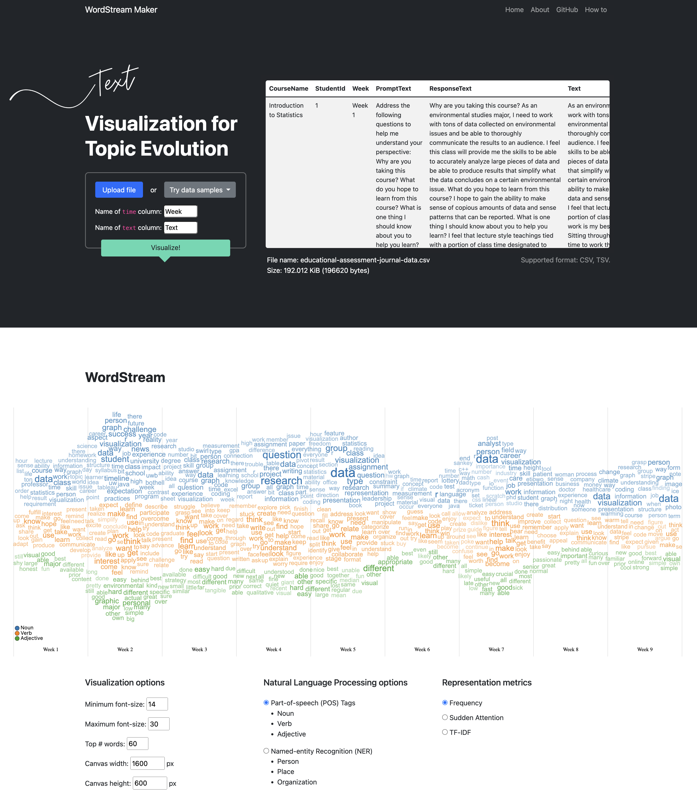

# WordStream maker

## A Lightweight End-to-end Visualization Platform for Qualitative Time-series Data

**Application**: https://huyen-nguyen.github.io/maker/

**PDF**: https://arxiv.org/pdf/2209.11856.pdf

**Publication**: Nguyen, Huyen N., Tommy Dang, and Kathleen A. Bowe. "WordStream Maker: A Lightweight End-to-end Visualization Platform for Qualitative Time-series Data." NLVIZ: Exploring Research Opportunities for Natural Language, Text, and Data Visualization, IEEE VIS 2022.

**Citation**:

    @article{nguyen2022wordstream,
    title={WordStream Maker: A Lightweight End-to-end Visualization Platform for Qualitative Time-series Data},
    author={Nguyen, Huyen N and Dang, Tommy and Bowe, Kathleen A},
    journal={NLVIZ: Exploring Research Opportunities for Natural Language, Text, and Data Visualization, IEEE VIS 2022},
    year={2022}
    }

